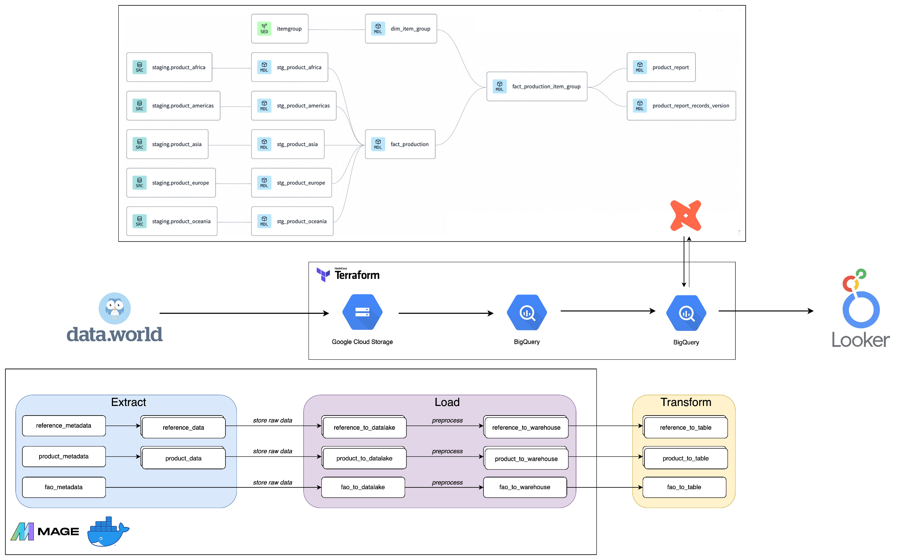
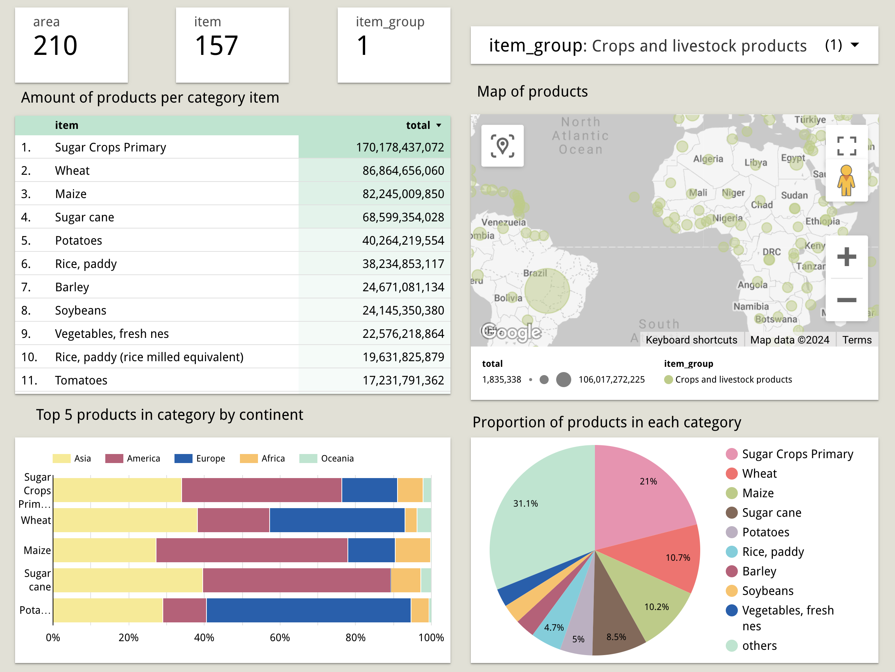
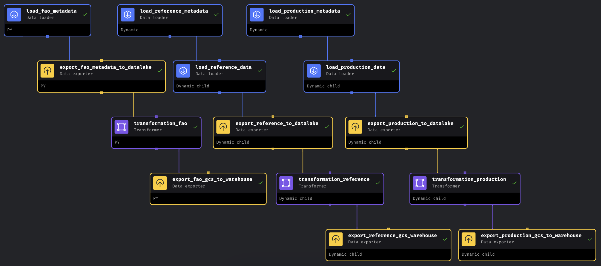
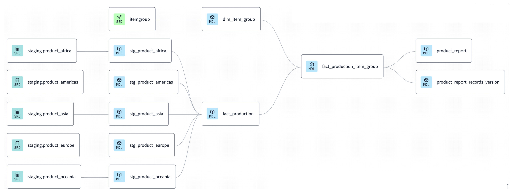

# Crop Production Pipeline Project 🌏

The Food and Agriculture Organization of the United Nations (FAO) provides comprehensive crop statistics covering 173 products across various regions globally. <br>
For more detailed information, you can visit <a href = "https://www.fao.org/faostat/en/#data">the FAO website</a> crop statistics.

## Table of contents

- [Crop Production Pipeline Project 🌏](#crop-production-pipeline-project-)
  - [Table of contents](#table-of-contents)
  - [Introduction](#introduction)
  - [Dataset](#dataset)
  - [Infrastructure](#infrastructure)
  - [Dashboard](#dashboard)
  - [Reproducibility](#reproducibility)
  - [Special Thanks](#special-thanks)

## Introduction

This project aims to provide comprehensive insights into global crop production statistics sourced from the Food and Agriculture Organization of the United Nations (FAO). By ingesting data from <a href = "https://data.world/agriculture/crop-production">Data World</a> and generating <a href = "https://lookerstudio.google.com/reporting/f62e4703-b18e-491c-97f5-c34551975fa4">Crop Production Dashboard</a>, the project will strive to enhance understanding and facilitate informed decision-making. <br>

This could help answer questions:
<ol>
    <li>What are the top 5 crop items produced in each continent in terms of quantity over the years?</li>
    <li>How does the proportion of crop production vary across category?</li>
    <li>What is the geographical distribution of specific crop categories across different areas?</li>
</ol>

## Dataset
The dataset in which all transformations and analysis will be developed is <a href = "https://data.world/agriculture/crop-production">Crop Production</a> published on Data World. Given that this dataset is in CSV format and largely clean. <br>

Crop Production dataset contains multiple tables:
- FAO Metadata
- Reference
  - Elements
  - Flags
  - Items
  - Units
- Production Crops (5 tables for each continent)

## Infrastructure
The following tools and technologies are used:
- Cloud - <a href = "https://cloud.google.com/?hl=en">Google Cloud Platform</a>
- Infrastructure as Code - <a href = "https://www.terraform.io/">Terraform</a>
- Containerization - <a href = "https://www.docker.com/">Docker</a>
- Orchestration - <a href = "https://www.mage.ai/">Mage</a>
- Transformation - <a href = "https://cloud.getdbt.com/">dbt</a>
- Data Lake - <a href = "https://cloud.google.com/storage?hl=en">Google Cloud Storage</a>
- Data Warehouse - <a href = "https://cloud.google.com/bigquery?hl=en">BigQuery</a>
- Data Visualization - <a href = "https://lookerstudio.google.com/">Looker Studio</a>


## Dashboard
The report is built on top of the data marts created in dbt and shared in Looker Studio. It includes item_group filter to analyze crops. You can take a look into the finished dashoard <a href = "https://lookerstudio.google.com/reporting/f62e4703-b18e-491c-97f5-c34551975fa4">here</a>



## Reproducibility
1. Config GCP
   1. Create project in Google Cloud Platform
   2. Create Service Account
   - Role: `BigQuery Admin`, `Storage Admin`, `Storage Object Admin`, `Viewer`
   - Create credential key (Json)
    REMEMBER: enable APIs (BigQuery, credential)

2. Connect Google Cloud to local machine and authorize the gcloud CLI
   1. Install gcloud - <a href = "https://cloud.google.com/sdk/docs/install">here</a>
   2. Authorizing gcloud - <a href = "https://cloud.google.com/sdk/docs/authorizing">here</a>
   
3. Config Terraform - <a href = "https://github.com/DataTalksClub/data-engineering-zoomcamp/tree/main/01-docker-terraform/1_terraform_gcp/terraform/terraform_with_variables">template</a> 
   1. Add credential keys
   2. Change `main.tf` and `variables.tf`
   3. Run commands
   
   ```
    terraform init
   ```
   ```
    terraform plan -var="project=<gcp-project-id>"
   ```
   ```
    terraform apply -var="project=<gcp-project-id>"
   ```

4. Config docker for Mage - <a href = "https://github.com/mage-ai/mage-zoomcamp">template</a> (You can deploy Mage in Cloud by using Terraform - <a href="https://github.com/mage-ai/mage-ai-terraform-templates">templates</a>)
   1. Create `Dockerfile`, `docker-compose.yml`, `requirements.txt`, `.env`
   2. Run docker commands (Open Docker Desktop before run)
   
   ```
    docker compose build
   ```
   ```
    docker compose up
   ```
   3. Navigate to `localhost:6789`
   4. Build data pipeline
      1. Extract data from API (work with dynamic blocks <a href ="https://docs.mage.ai/design/blocks/dynamic-blocks">here</a>)
      2. Ingest raw data to datalake
      3. Preprocessing
      4. Load data to data warehouse
   


5. Transform with dbt



6. Generate dashboard in Looker Studio

## Special Thanks
A big thank you to <a href = "https://github.com/DataTalksClub">DataTalksClub</a> for their amazing <a href="https://github.com/DataTalksClub/data-engineering-zoomcamp">Data Engineering Zoomcamp</a>! 